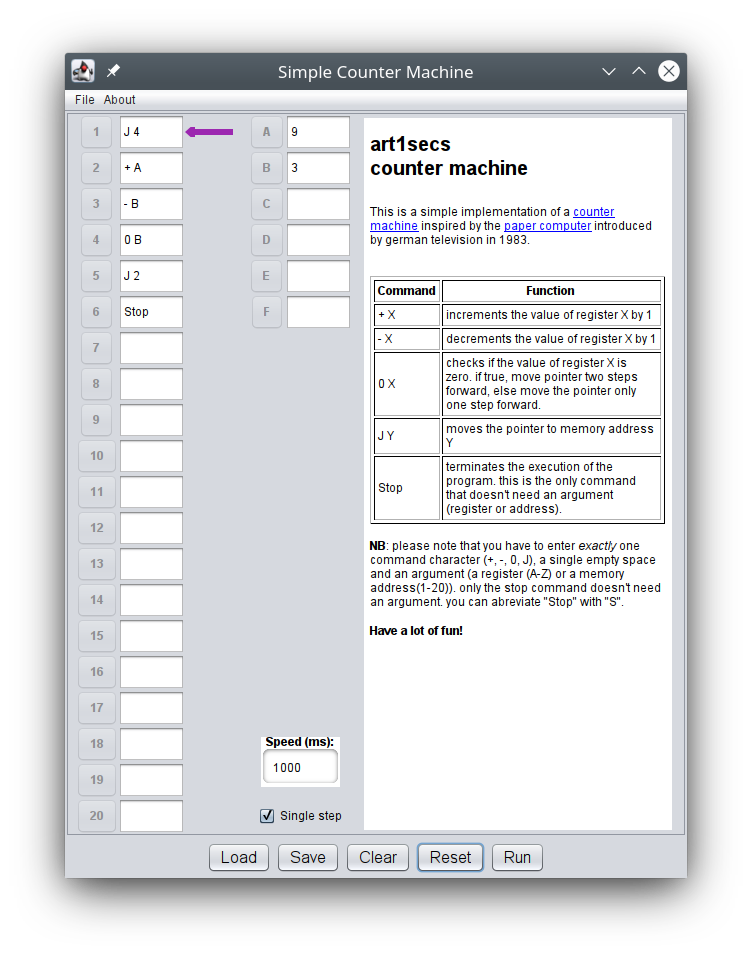

# JCounterMachine
#### A Simple Counter Machine written in Java w/ Swing

This is a simple implementation of a [counter machine](https://en.wikipedia.org/wiki/Counter_machine) inspired by the [paper computer](https://en.wikipedia.org/wiki/WDR_paper_computer) introduced by german television in 1983.

---

